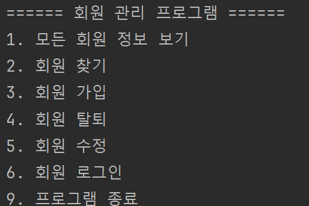

# 회원 관련 기능 

- 회원 정보
    - 회원번호, 아이디, 비밀번호, 나이, 취미, 혈액형 속성을 가지고 있으며 비밀번호는 md5 알고리즘을 이용해 encoding 했습니다.
- 회원 수정기능 
    - 회원번호를 선택하고 해당 회원의 모든 속성을 변경할 수 있습니다
- 회원 로그인 기능
  - 회원의 아이디, 비밀번호를 알맞게 입력한 경우 로그인을 할 수 있으며 입력한 비밀번호를 md5로 변환하고 저장된 비밀번호와 비교하여 로그인을 합니다.
